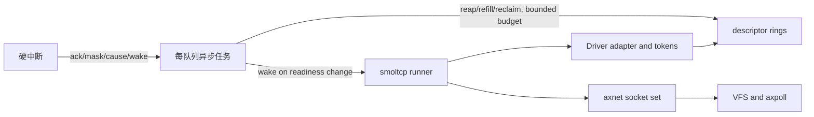

# StarryOS 网络开发总览

> Project: StarryOS
> Branch: net-k3
> Updated: 2026-08-09
> Product analysis baseline: `2ccb836a6541bfcf13fd134b5b321fb31c9be52d`
> Local smoltcp: `f96a26b5968735d142e6999a016060bc5d3ab2b7`
> Local Embassy: `106dc1952bb681e115037ef97dce1bea31094a93`
> Local ArceOS: `68bda6dbb7655f383fde01ff60b50b8a02694ce3`
> See also: [实施探索](starryos-network-development-strategy.md)、[任务状态](../docs/tasks.md)

本文是网络开发的跨 session 入口。当前状态以 tasks 为准，规范约束以 M/D/K 为准，代码证据和推导保留在专题分析中。

## 新 session 读取顺序

1. 读取仓库根目录的 [`CLAUDE.md`](../../CLAUDE.md)。
2. 读取 [SNAPSHOT](../docs/SNAPSHOT.md) 和 [tasks](../docs/tasks.md)。
3. 执行 `openspec list`，检查活跃 change。
4. 读取本文和当前 milestone 对应的专题分析。
5. 实施时读取 change、最新 iteration 和 Evidence。

当前没有活跃 change。MS01、MS02、MS03 和 MS16 已完成并归档；下一步是为 MS04 建立 Plan。当前状态和 Evidence 入口以 [tasks](../docs/tasks.md) 为准。

## 当前结论

StarryOS 不需要重写 TCP/IP、socket API 或调度器。现有 `axnet-ng`、smoltcp、VFS、`axpoll` 和 `axtask` 继续作为上层基础。新增工作位于设备与协议栈之间。

推荐顺序：

1. 保持已经完成的本地 smoltcp 0.13.1、axnet、VirtIO-MMIO 轮询与诊断 IRQ 基线。
2. 在 QEMU VirtIO-MMIO 上建立 queue task、有界 packet slot 和 stack runner。
3. 完成 socket readiness、reset 和 QEMU 多 hart 正确性。
4. 确认目标板后建立板级事实 Gate，再选择对应 MAC 控制器后端。
5. 先在真板建立轮询收发和可诊断 IRQ/DMA 基线，再接入 QEMU 已验证的异步公共层。
6. 真板稳定后再按数据评估零拷贝、多队列、offload 和中断合并。

首版不引入 `embassy-executor`、完整 `embassy-net`、无界 channel 或用户态 RX/TX mmap ring。QEMU 结果不作为任何真板的 DMA、cache、PHY、IRQ、SMP 或性能证据。

## 当前调用链和阻塞点

启动和 socket 路径为：

```text
axruntime
  -> axdriver::init_drivers()
  -> VirtIO probe
  -> axnet_ng::init_network()
  -> EthernetDevice + Router + Service + SocketSet

syscall/VFS Socket
  -> axnet-ng TCP/UDP
  -> poll_interfaces()
  -> smoltcp Interface::poll()
```

当前进展依赖 socket 操作主动调用 `poll_interfaces()`。尚无独立 stack runner。初始化发生在 kernel entry 之前，因此只修改 `kernel/` 不能替换设备和协议栈注入点。

当前边界：

| 阻塞 | 影响 | 对应任务 |
|---|---|---|
| smoltcp/axnet 同步兼容 | 已由 MS01 固化，不在异步阶段重写 | MS01 |
| VirtIO-MMIO 轮询和诊断 IRQ | 已由 MS02/MS03 固化；当前 handler 不搬 descriptor、不唤醒 queue task | MS02-MS03 |
| `NetDriverOps` 缺少 queue control 和完整异步 completion 语义 | 仅增加 socket waker 无法实现可靠 rearm 和所有权转移 | MS04-MS05 |
| 目标板、MAC 控制器和平台事实尚未确定 | 不预选 DWMAC，也不提前复制 VF2 配置 | 目标板事实 Gate |

代码入口：

- [`Cargo.toml`](../../Cargo.toml)
- [`kernel/src/file/net.rs`](../../kernel/src/file/net.rs)
- [`kernel/src/drivers/os_arceos.rs`](../../kernel/src/drivers/os_arceos.rs)
- [`kernel/src/platform/mod.rs`](../../kernel/src/platform/mod.rs)
- [`kernel/src/drivers/virtio_net_irq.rs`](../../kernel/src/drivers/virtio_net_irq.rs)
- [`crates/smoltcp/src/iface/interface/mod.rs`](../../crates/smoltcp/src/iface/interface/mod.rs)

## 目标数据流

```text
hard IRQ
  -> cause / ack / mask / event generation / wake
  -> per-queue task
       -> bounded completion / refill / reclaim
       -> bounded RX/TX packet slots
       -> register-recheck / rearm
  -> stack runner
       -> bounded smoltcp ingress / egress / maintenance
       -> device / software / timer wake
  -> socket event bridge
  -> axpoll / VFS / syscall
```

执行约束：

- ISR 不调用 smoltcp，不分配，不阻塞。
- 每个 queue 由一个 task 推进。
- stack runner 独占 `Interface` 和 `SocketSet` 修改。
- 每个等待点执行“检查、注册、复查”。
- budget 耗尽时重排任务，不运行无界 drain loop。
- reset 递增 generation，旧 completion 和 token 不进入新 ring。
- Rust 原子序、DMA barrier、cache 操作和 MMIO 顺序分别建模。

首版使用有界 packet slot，并接受可观测的复制。descriptor-backed token 只在 MS14 基线产生优化依据后进入 MS15 候选，不作为异步 MVP 前置条件。

## 依赖采用边界

| 组件 | 当前用途 | 处理 |
|---|---|---|
| 本地 smoltcp 0.13.1 | TCP/IP 协议栈当前版本 | MS01 已接入；显式使用 Reno |
| `axnet-ng` | socket、路由、smoltcp 集成 | 本地化并移除 fork API |
| `axdriver_net` | 同步驱动兼容面 | 保留，不作为异步硬件 contract |
| `axdriver_virtio` | VirtIO 网络包装 | 暴露 IRQ control 和 completion |
| `virtio-drivers 0.7.5` | transport 和 virtqueue | 继续复用 |
| `axtask` | 唯一任务执行器 | 运行 queue 和 stack future |
| `axpoll` | 多 socket waiter | 桥接 smoltcp 单槽 waker |
| `embassy-sync 0.6.2` | `AtomicWaker` | 已批准的 Embassy 依赖 |

以下模块只作为设计输入：

- `embassy-net-driver`：`Context` 感知 readiness 和 token。
- `embassy-net-driver-channel`：runner/device 和有界 slot。
- `embassy-net`：device、software、timer wake 合流。
- ArceOS DWMAC/axdma：QEMU 阶段用于审查 transport-neutral contract；真板阶段按控制器类型选择代码或经验。

是否直接依赖 `embassy-net-driver` 尚未决定。`embassy-net-driver-channel 0.4.0` 会带入 `embassy-sync 0.8.0`，首版不采用。

## 验证阶梯

| 阶段 | 任务 | 证据 |
|---|---|---|
| 同步兼容与 MMIO 基线 | MS01-MS03、MS16 | socket 回归、轮询收发、诊断 IRQ 和统一 benchmark 协议 |
| QEMU 异步数据面 | MS04-MS06 | lost wakeup、budget、背压、空闲无轮询和多 waiter |
| QEMU 恢复与 SMP | MS07-MS08 | reset、late completion、取消和多 hart ordering |
| 目标板事实与可观测性 | MS09-MS10 | 启动、控制器、MMIO、PHY、IRQ、clock/reset 和 DMA/cache 事实 |
| 真板轮询与异步接入 | MS11-MS13 | 轮询收发、transport adapter、reset 和 completion 语义 |
| 真板稳定性与优化 | MS14-MS15 | SMP、soak、性能基线和单项 A/B |

QEMU 可证明软件所有权、IRQ→task→stack 控制流和大部分竞态。它不能证明目标板的 clock/reset/PHY、非一致 cache、DMA、IRQ 时序或吞吐。

## 工作量

原 R42 的 21-37 人周和 VF2 日历估算基于已经失效的 PCI-first、VF2/DWMAC 固定路线，不再作为当前交付承诺。QEMU MS04-MS08 的范围没有因目标板变化而扩大；目标板确定并完成事实 Gate 后，重新估算 MS09-MS15。历史假设保留在[已归档交付估算](_archive/starryos-network-delivery-estimate.md)供追溯。

## 风险和未决项

| 项目 | 当前边界 | 决定时点 |
|---|---|---|
| driver contract | `NetQueueControl` 与 `StackNetDevice` 分层；DWMAC 只作第二设备模型审查 | MS04 Plan |
| stack runner 粒度 | 当前按单接口设计；多接口未定 | MS06 Plan |
| reset 与 SMP | QEMU 必须先形成独立软件证据 | MS07-MS08 |
| 目标板事实 | 控制器、DMA/cache、PHY、IRQ、clock/reset 和 bootloader handoff 未知 | MS09 |
| ArceOS 代码适用性 | 目标控制器兼容 DWMAC 时才评估代码移植 | MS09-MS11 |
| multiqueue/zero-copy | 没有真板性能数据前不实施 | MS15 |

## 专题来源

| 文档 | 保留的信息 |
|---|---|
| [R24 Embassy 评估](embassy-network-module-evaluation.md) | 12 个模块、trait、channel 和版本边界 |
| [R25 ArceOS 网卡分析](arceos-async-network-driver-analysis.md) | 对 QEMU、异步公共层和目标真板的分级价值；DWMAC 条件化复用边界 |
| [R26 异步路线](starryos-async-network-roadmap.md) | ownership、状态机、backpressure 和 lifecycle |
| [R41 实施探索](starryos-network-development-strategy.md) | 当前代码调用链、VirtIO-MMIO 异步边界和目标板条件化 Gate |
| [R14 真板验证](arceos-true-board-validation.md) | VF2 案例形成的启动、寄存器、中断和 workload 方法，不代表目标板选择 |
| [R42 已归档交付估算](_archive/starryos-network-delivery-estimate.md) | 旧 PCI-first、VF2/DWMAC 固定路线的历史估算；目标板路线需重估 |

以下内容是 2026-07-18 的原始探索输入。保留它用于追溯早期范围和判断。

原始基线：StarryOS `uart-16550-lichee@8400e55`、Embassy `106dc1952`、ArceOS `68bda6d`。

**原始探索目标**

异步 UART 已在 QEMU 和 D1 真板形成可复用的工程方法。本轮探索不实现网卡驱动，而是回答四个前置问题：

1. UART 的哪些经验可迁移到网卡，哪些结构不能照搬。
2. 本地 Embassy 仓库中有多少网络模块可帮助 StarryOS。
3. `work/arceos` 的异步网络工作哪些可复用，哪些存在架构风险。
4. StarryOS 应如何分阶段建立异步高性能网卡的数据面。

结论是：应保留 StarryOS 现有 `axnet-ng`、smoltcp、VFS/socket 和 axtask 体系，在设备层引入上下文感知的 readiness、DMA 描述符所有权、最小硬中断、预算化队列任务和协议栈 runner。Embassy 提供接口与队列模型，ArceOS 提供 DWMAC、DMA 和 smoltcp adapter 的本地工程证据，两者都不应整套替换 StarryOS 运行时。

**原始工程基线**

**StarryOS 网络路径**

当前 StarryOS 通过 `axdriver = 0.3.0-preview.2` 和 `axnet-ng = 0.3.0-preview.2` 接入网络。内核 socket syscall 已有 TCP/UDP、poll/select/epoll 等上层入口，但仓库内没有形成独立的异步 NIC 队列执行层。

现有边界适合渐进式演进：

```text
用户 socket
    |
VFS / axpoll
    |
axnet-ng / smoltcp
    |
axdriver NetDevice
    |
同步设备轮询或具体硬件驱动
```

本轮建议只重构最后两层之间的执行和通知模型，不先重写 socket API 或协议栈。

**UART 已证明的方法**

`uart_16550` 和 StarryOS 适配层已经证明以下方法有效：

- 硬中断只做状态处理和唤醒，数据搬运交给后台任务。
- readiness 使用“检查、注册、再次检查”，避免 lost wakeup。
- 有界队列必须显式定义满、空、阻塞、非阻塞和唤醒语义。
- 完成不能等同于“已接受提交”。UART TX drain 同时观察 ring、copier、staged byte 和 transmitter empty。
- OS 运行时通过最小 adapter 注入，不把 Embassy executor 带入内核。
- QEMU、单核真板和 SMP 证据必须分开陈述。

这些原则可以迁移，但 UART 的字节 SPSC ring 和 copier 不能直接成为 NIC 数据面。NIC 的基本所有权单位是 packet buffer 与 DMA descriptor，不是字节。

**Embassy 模块盘点结论**

本地 Embassy 仓库共核对 12 个网络专用 crate 或硬件模块，即 11 个网络 crate 加 `embassy-stm32::eth`。此外还核对了通用支撑 crate `embassy-sync`、`embassy-futures` 和 `embassy-time`。按对 StarryOS 的能力价值分类：

| 分类 | 模块或家族 | 对 StarryOS 的价值 |
|------|------------|--------------------|
| 近期采用或适配 | `embassy-net-driver`、`embassy-net-driver-channel`/`zerocopy_channel`、`embassy-sync` wake 原语 | 高 |
| 集成与实现参考 | `embassy-net`、`embassy-stm32::eth`、`embassy-net-tuntap` | 中高 |
| 需要本地运行时替代 | `embassy-futures`、`embassy-time` | 中 |
| 特定硬件参考 | ADIN1110、ENC28J60、WIZnet、CYW43、ESP-hosted、NRF91、PPP | 低到中 |

12 是网络专用实现的仓库计数，8 是合并后的可借鉴能力类型，两者不是同一维度。其中近期建议真正采用或适配的只有 3 类。详细证据见《Embassy 网络模块评估》。

**ArceOS 借鉴结论**

`work/arceos` 已具备：

- `NetDriverOps`、`NetBufPtr` 和 buffer pool 所有权接口。
- DWMAC descriptor ring、DMA coherent allocation、CPU/bus address 分离和 cache flush。
- smoltcp `Device`/token adapter。
- socket async future 和自定义 executor 的探索。
- VisionFive2 真板时钟、复位、寄存器和中断证据。

但它还不是可直接复制的高性能异步 NIC 架构：

- 部分网卡中断路径直接打印日志、持锁并轮询 smoltcp。
- 设备 driver readiness 没有携带 `Context`/waker，依赖 ISR 主动触发全栈 poll。
- `AcceptFuture` 在 `WouldBlock` 后缺少 accept waker 注册，存在永久 Pending 风险。
- 全局设备、接口和 socket 锁不适合直接扩展到 SMP 与 multiqueue。
- 自定义 `axasync` 不应替换 StarryOS 已有 axtask。

正确用法是复用其硬件和 DMA 证据，并重做中断到队列任务、队列任务到协议栈的异步边界。

**建议目标架构**



关键边界：

1. 硬中断不得执行完整协议栈 poll。
2. RX/TX descriptor 由唯一队列 owner 推进，packet buffer 通过 token 转移。
3. 队列任务每轮使用 budget，耗尽后主动让出，避免单设备垄断 CPU。
4. driver readiness 必须能注册接收、发送、link-state 等 waker。
5. smoltcp runner 在任务上下文轮询，不在 ISR 内持全局锁。
6. DMA cache 同步、设备内存屏障和 Rust 原子内存序分别建模。

**执行上下文与所有权**

| 上下文 | 可做工作 | 不可做工作 | 主要 owner |
|--------|----------|------------|------------|
| hard IRQ | 读 cause、ack/mask、保存错误、固定预算 completion、wake | await、阻塞 allocator、无界 poll、完整协议栈 | IRQ shadow state |
| queue task/bottom half | descriptor reap/refill/reclaim、DMA sync、budget poll | 持自旋锁 await、无界 retry | 单个硬件 queue |
| stack runner | smoltcp poll、timer、socket wake | 直接修改设备 IRQ/reset 寄存器 | interface 与 stack poll |
| process/syscall | copy、blocking/nonblocking、poll/select/epoll | 直接持有设备 descriptor | file/socket request |

首版选择 hard IRQ 只 wake 是目标架构策略，不表示所有 NIC 在任何条件下都禁止 ISR 固定预算回收。后续若测量证明 wake 延迟过高，可在不分配、不阻塞、预算有上限的前提下评估少量 completion。

**三条路径与生命周期**

- Data path：packet、descriptor 和 DMA buffer。
- Control path：probe、queue 配置、IRQ、link、reset、power。
- Completion path：发布状态、错误和 ownership transfer。

设备状态至少应覆盖 `Discovered -> Probed -> Started -> Quiescing -> Resetting/Suspended -> Removed`。进入 quiesce 后必须阻止新提交；reset/remove 前必须处理 device-owned、completed-unreclaimed 和 stack-token 三类对象，并用 generation 隔离迟到 completion。

**初步实施路线**

| 阶段 | 目标 | 主要 Gate |
|------|------|-----------|
| N0 | 固化当前 axnet、virtio-net/DWMAC 路径和性能基线 | API、吞吐、CPU proxy、IRQ 数、丢包基线可复现 |
| N1 | QEMU virtio-net 建立异步队列任务与 stack runner | 功能、无 busy loop、无 lost wakeup |
| N2 | 完成 descriptor ownership、backpressure 和 completion 测试 | ring 满/空、取消、复位、错误恢复 |
| N3 | 多 hart 和 multiqueue 正确性验证 | 无重复回收、无跨队列所有权冲突 |
| N4 | VisionFive2 DWMAC 真板接入 | DMA/cache/IRQ/时钟证据和稳定收发 |
| N5 | 性能优化 | batching、budget、interrupt moderation、零拷贝按数据决策 |

D1 Lichee RV Dock 适合继续作为 UART 证据板，但不是当前 NIC 性能工作的自然主板。初步建议用 QEMU virtio-net 建立模型，再用已有 ArceOS 证据较多的 VisionFive2 DWMAC 完成真板验证；最终板卡仍需在正式 planning 阶段确认。

**早期风险**

| 风险 | 表现 | 初步控制 |
|------|------|----------|
| lost wakeup | ring 已可用但 future 永久 Pending | register-recheck 和状态代际计数 |
| IRQ storm | 条件未清除或过早重开中断 | mask、ack、drain、recheck、unmask 固定协议 |
| DMA 所有权错误 | 重复回收、设备访问已释放 buffer | descriptor 状态机与唯一 queue owner |
| cache/屏障错误 | 真板偶发包损坏，QEMU 正常 | coherent/streaming DMA 明确分层 |
| 锁粒度过大 | SMP 扩展差、长尾高 | per-queue 状态，协议栈 poll 移出 ISR |
| waiter 数量错误 | 多 socket/任务覆盖单槽 waker | 单 waiter 契约或 wait queue/event counter |
| reset 迟到完成 | 旧 descriptor 命中新 queue | queue/device generation |
| remove 后 DMA | 设备写入已回收内存 | quiesce、stop bus mastering、drain/fail in-flight |
| 不可信 metadata | 越界 length/index 导致内存破坏 | 校验 descriptor、MTU、segment 和 ring index |
| 过早零拷贝 | unsafe 范围扩大但收益不明 | 先 token 化所有权，再以指标决定 mmap/zero-copy |
| executor 冲突 | 两套调度、timer 和 wake 语义 | 保留 axtask，只移植 Embassy driver/channel 思想 |

**原始探索结论**

StarryOS 已具备开展异步 NIC 的上层条件，缺口主要在设备与协议栈之间的异步队列执行层，而不是 socket API。下一步最稳妥的方向是：

1. 用 `embassy-net-driver` 的 token/readiness 语义定义本地 adapter。
2. 用 `embassy-net-driver-channel` 和 `zerocopy_channel` 理解 packet slot 回收模型。
3. 用 UART 已验证的最小 ISR 和 wake 规则驱动每队列任务。
4. 用 ArceOS DWMAC/axdma 代码和真板证据补齐 DMA、cache 和平台控制。
5. 保留 axnet-ng、smoltcp、axtask，先完成 QEMU virtio-net MVP，再进入真板。

本轮结论是方向性分析，不代表正式选型或实施授权。正式开发前应由 `openspec-plan` 把 N0/N1 转化为可验证 change。

**原始关联文档**

- [Embassy 网络模块评估](embassy-network-module-evaluation.md)
- [ArceOS 异步网卡驱动分析](arceos-async-network-driver-analysis.md)
- [StarryOS 异步高性能网卡路线图](starryos-async-network-roadmap.md)
- [异步 UART 与 io_uring 对比](_archive/async-uart-vs-io_uring.md)
- [UART backpressure 与 MPSC 规划](_archive/uart-backpressure-mpsc-plan.md)
- [ArceOS 真板验证方法](arceos-true-board-validation.md)
